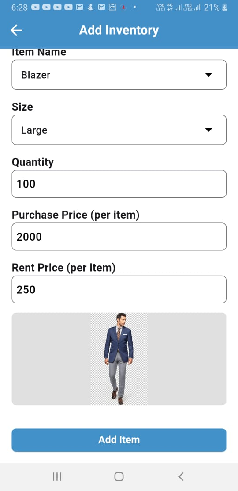
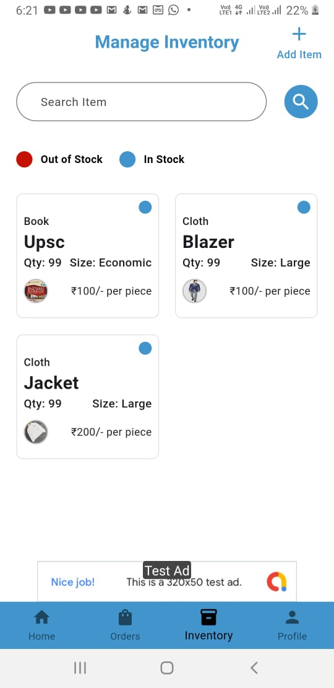
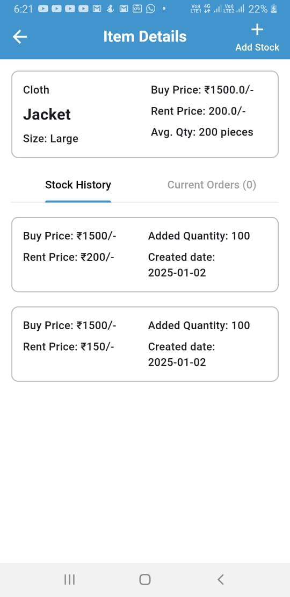

# Rent & Return App

Rent & Return is a vendor-side application that allows you to:
- Add and manage inventories
- Place and take return orders
- Generate PDFs

## Features

- **Inventory Management**: Easily add, edit, and manage your inventory.
- **Order Management**: Place new orders and manage return orders.
- **PDF Generation**: Generate detailed PDF reports for orders and inventory.

## Screenshots

## Screenshots





## Getting Started

These instructions will get you a copy of the project up and running on your local machine for development and testing purposes.

### Prerequisites

- Flutter SDK
- Dart SDK

### Installation

1. Clone the repository:
    ```bash
    git clone https://github.com/rachit805/rent_return_app.git
    cd rent_return_app
    ```

2. Install dependencies:
    ```bash
    flutter pub get
    ```

3. Run the app:
    ```bash
    flutter run
    ```

## Usage

### Adding Inventory

1. Go to the Inventory Management screen.
2. Click on 'Add Item'.
3. Fill in the required details and submit.

### Placing Orders

1. Go to the Order Management screen.
2. Click on 'Place Order'.
3. Fill in the order details and submit.

### Generating PDFs

1. Go to the Reports section.
2. Select the report type and date range.
3. Click on 'Generate PDF'.

## Contributing

We welcome contributions to improve this project. Please follow these steps:

1. Fork the repository.
2. Create a new branch:
    ```bash
    git checkout -b feature/your-feature-name
    ```
3. Make your changes and commit them:
    ```bash
    git commit -m 'Add some feature'
    ```
4. Push to the branch:
    ```bash
    git push origin feature/your-feature-name
    ```
5. Create a new Pull Request.

## License

This project is licensed under the MIT License - see the [LICENSE](LICENSE) file for details.

## Acknowledgments

- Flutter
- Dart
- The open-source community

For more details, refer to the [documentation](https://docs.flutter.dev/).
